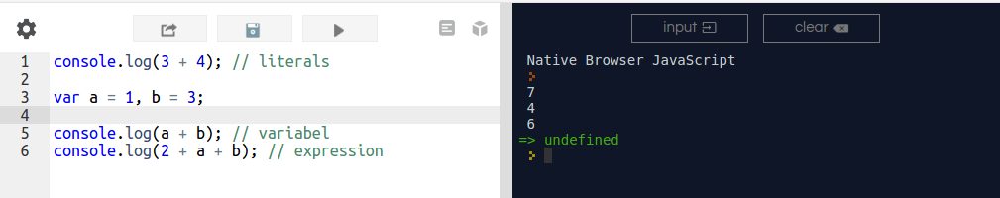
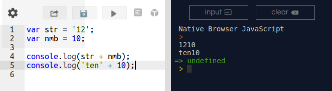
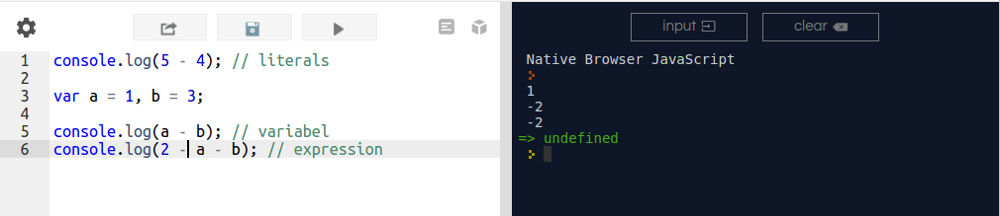
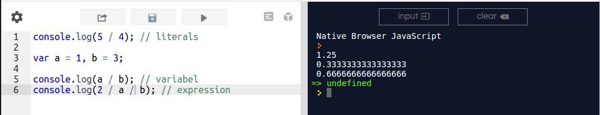
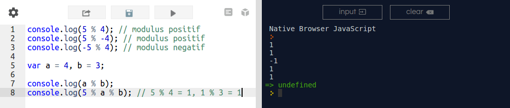

# 27 Juli 2022

## Rekursif dan Modulus

<b>Rekursif</b>

Fungsi harus memiliki langkah untuk membawa kita lebih dekat ke kondisi utama, yang dimaksud disini adalah langkah rekursif. Dalam langkah rekursif, masalahnya dikurangi menjadi versi masalah yang lebih kecil.
 
 >Misalnya kita memiliki fungsi yang akan menjumlahkan angka dari 1 hingga n. Misalnya, jika n = 4, itu akan berjumlah 1 + 2 + 3 + 4.

 Pertama, kami menentukan kondisi utama. Menemukan kondisi utama juga dapat dianggap sebagai menemukan kondisi dimana masalah dapat diselesaikan tanpa rekursi. Dalam kondisi ini, saat n sama dengan nol. Zero (nol) tidak memiliki bagian, sehingga rekursi kami dapat hentikan ketika kami mencapai nilai 0.

 >function sum(num){
    if (num === 0) {
        return 0;
    } else {
        return num + sum(--num)
    }
}
 
>sum(4);     //10

artinya:
>Menuju fungsi sum(4).

>Apakah 4 sama dengan 0? Jika tidak. Tempatkan sum(4) panda kondisi Menunggu dan Menuju fungsi sum(3).

>Apakah 3 sama dengan 0? Jika tidak. Tempatkan sum(3) panda kondisi Menunggu dan Menuju fungsi sum(2).

>Apakah 2 sama dengan 0? Jika tidak. Tempatkan sum(2) panda kondisi Menuggu dan Menuju fungsi sum(1).

>
Apakah 1 sama dengan 0? Jika tidak. Tempatkan sum(1) panda kondisi Menunggu dan Menuju fungsi sum(0).

>Apakah 0 sama dengan 0? Jika ya. Periksa sum(0).

>Mengambil fungsi sum(1).
>Mengambil fungsi sum(2).
>Mengambil fungsi sum(3).
>Mengambil fungsi sum(4).

<b>cara lain untuk melihat bagaimana fungsi memproses setiap panggilan:</b>

>sum(4)
4 + sum(3)
4 + ( 3 + sum(2) )
4 + ( 3 + ( 2 + sum(1) ))
4 + ( 3 + ( 2 + ( 1 + sum(0) )))
4 + ( 3 + ( 2 + ( 1 + 0 ) ))
4 + ( 3 + ( 2 + 1 ) )
4 + ( 3 +  3 ) 
4 + 6 
10

<b>Rekursi dengan List</b>

Rekursi dalam List serupa dengan rekursi pada angka, kecuali bahwa sebagai ganti pengurangan jumlah pada setiap langkah, kami mengurangi list pada setiap langkah sampai kami mendapatkan list dalam kondisi kosong.

contoh fungsi penjumlahan:

>function sum(l){
    if (empty(l)) {
        return 0;
    } else {
        return car(l) + sum(cdr(l));
    }
}

>Fungsi empty mengembalikan nilai true jika list tidak memiliki elemen. fungsi car mengembalikan elemen pertama dalam list. Sebagai contoh, car([1,2,3,4]) mengembalikan nilai 1. Fungsi cdr mengembalikan list tanpa elemen pertama. Sebagai contoh, cdr([1,2,3,4]) mengembalikan nilai [2,3,4]. 

<b>Membangun List</b>

>function remove(item, l){
    if (empty(l)) {
        return [];
    } else if (eq(car(l), item)) {
        return cdr(l);
    } else {
        return cons(car(l), remove(item, cdr(l)));
    }
}
 
>remove('c', ['a', 'b', 'c', 'd'])       //[‘a’, ‘b’, ‘d’]

fungsi eq mengembalikan nilai true jika kedua input sama. Fungsi cons mengambil elemen dan list sebagai masukan dan mengembalikan list baru dengan elemen yang ditambahkan di awal.

<b>Modulus</b>

>Penjumlahan, +

Pada JavaScript, operator penjumlahan menggunakan karakter plus, +.

Pada JavaScript, operator penjumlahan selain digunakan untuk menjumlahkan dua buah angka juga dapat digunakan sebagai operator konkatenasi untuk string, menyambung string.

Jika Anda mencoba melakukan ‘penjumlahan’ antara angka dan string maka hasilnya adalah string.

>Pengurangan, -

Operator pengurangan menggunakan karakter minus, -.

>Perkalian, *

Operator perkalian menggunakan karakter bintang, *.

>Pembagian, /

Operasi pembagian menggunakan karakter slash, /.

Operasi pembagian memungkinkan hasil dalam bentuk decimal dengan angka dibelakang koma hingga tak terhingga. JavaScript membulatkan angka dibelakang koma sampai dengan 16 digit jika angka dibelakang koma melebihi 16 digit.

>Modulus, %

Operasi modulus menggunakan karakter percent, %. Operasi modulus merupakan operasi untuk menghasilkan sisa, remainder, dari hasil pembagian. Oleh karena itu hasil dari operasi modulus selalu merupakan bilangan bulat, baik negatif, nol, atau positif.

